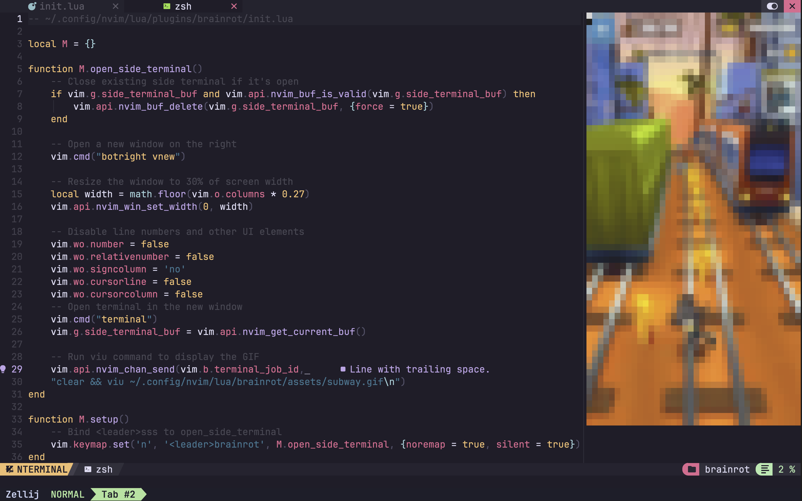

# brainrot.nvim



i'm so sorry

---

# installation

move the tumor into your nvim config folder

```
cp -r brainrot ~/.config/nvim/lua/
```

append the following to ~/.config/nvim/init.lua

```
-- the rest of your beautiful config

require("brainrot").setup()

```

launch with

```
<leader>brainrot
```

---

# uninstallation

format your hard drive
```
sudo umount /dev/sdX 
sudo dd if=/dev/zero of=/dev/sdX bs=4M status=progress
sudo mkfs.ext4 /dev/sdX  # For ext4 filesystem
```
